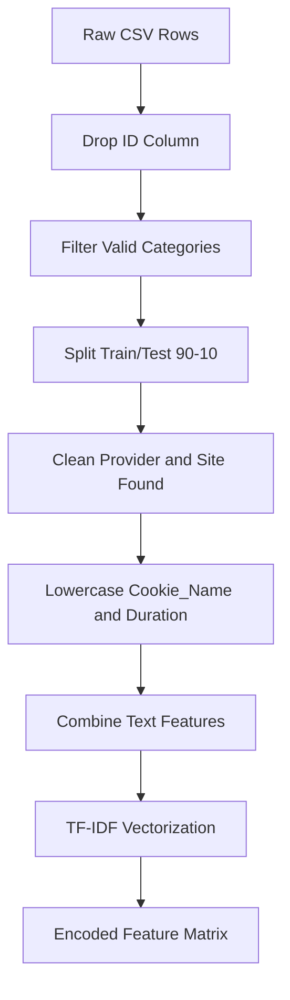
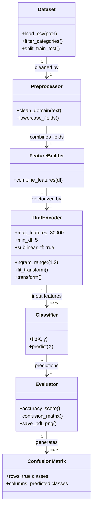
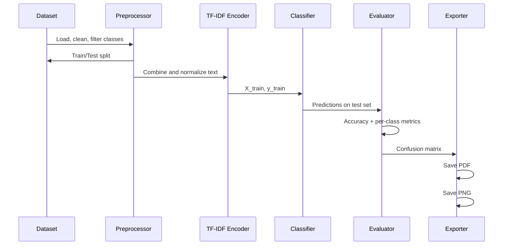
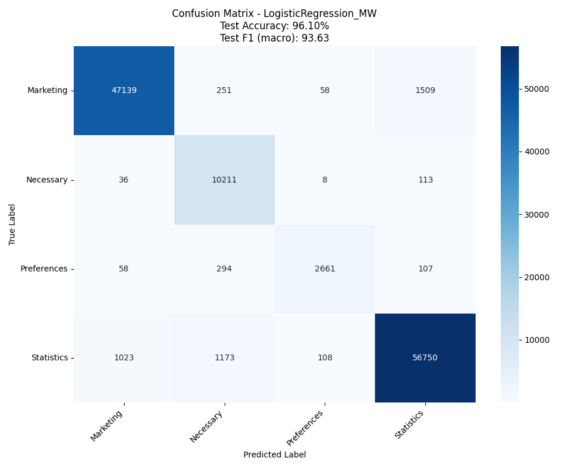
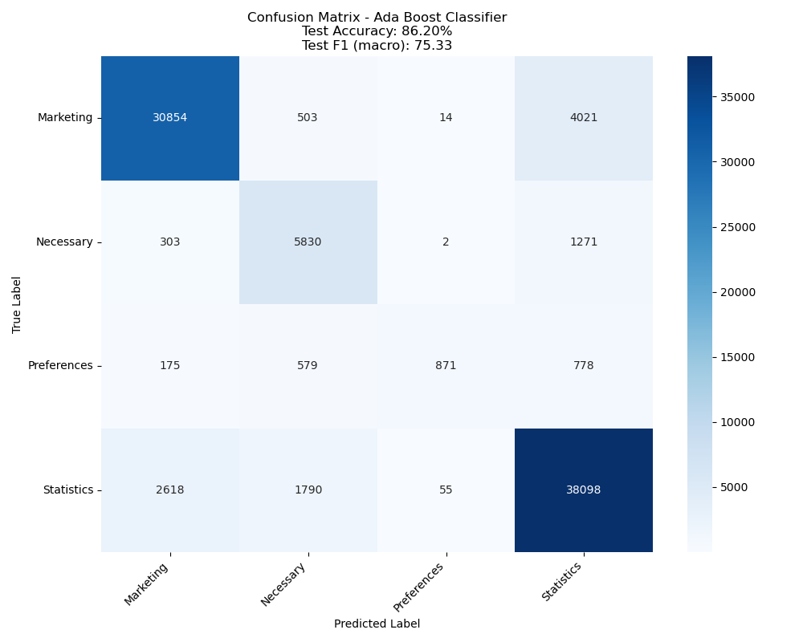
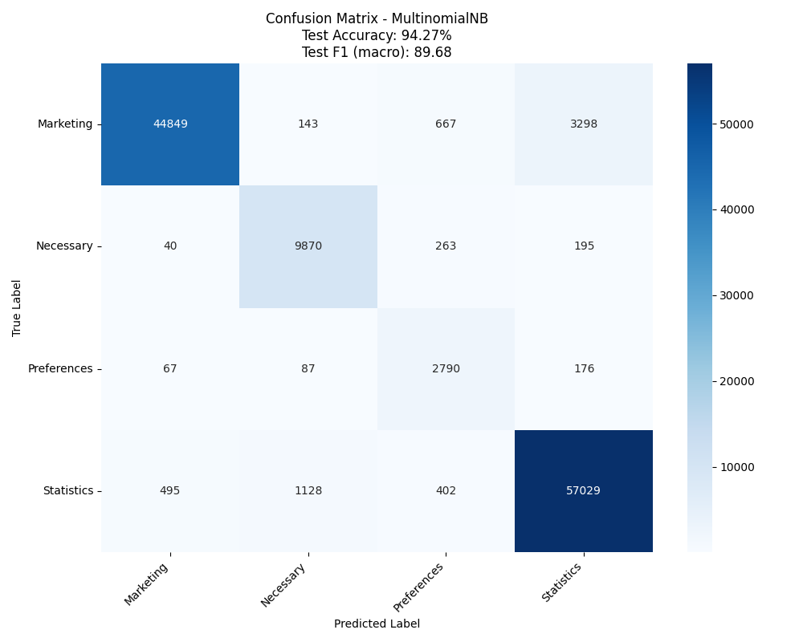
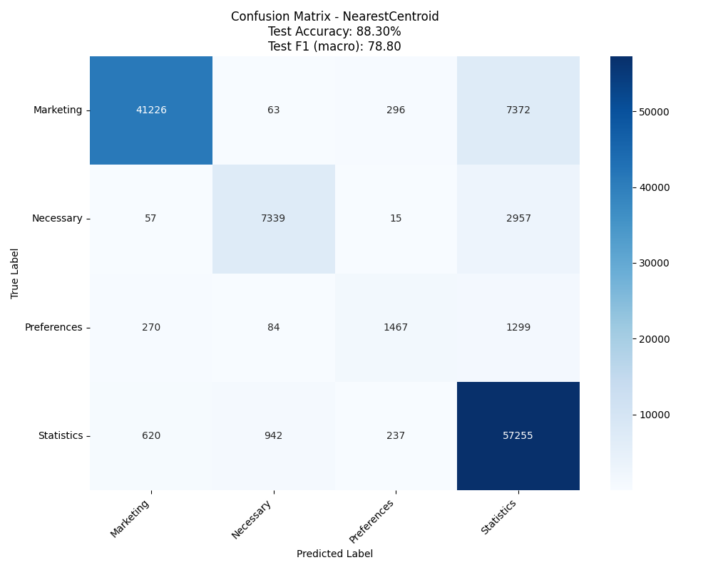
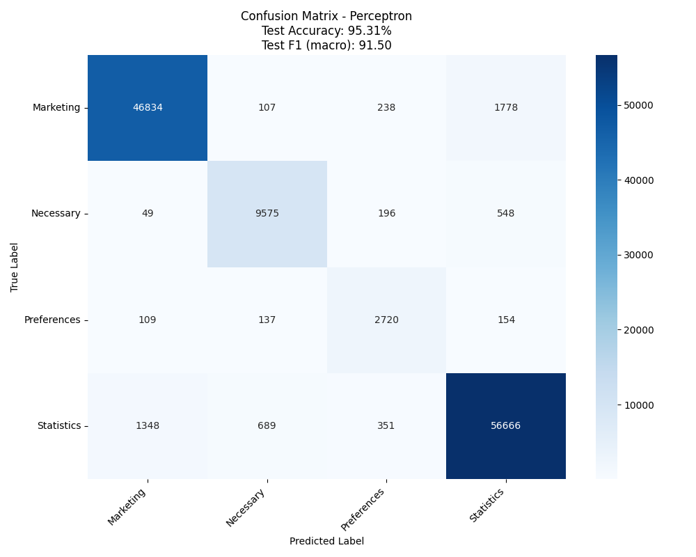
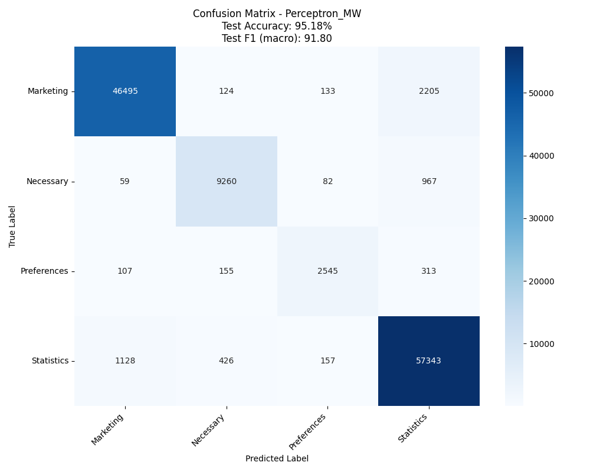

# AI COOKIE CLASSIFIER

> Cookie classification with TF-IDF + linear models, focused on strong per-class performance under class imbalance.


## Setup

This repo is a single-script workflow. Running it will:

- Load `classified_cookies.csv`
- Generate training data analysis plots under `training_data_analysis_*`
- Train/evaluate the enabled model(s)
- Write confusion matrices under `confusion_matrices_*`

### Option A — Python virtual environment (`venv`)

Windows (PowerShell):

```powershell
python -m venv .venv
.\.venv\Scripts\Activate.ps1
python -m pip install -U pip
pip install -r requirements.txt
python cookie_classifier.py
```

macOS/Linux:

```bash
python3 -m venv .venv
source .venv/bin/activate
python -m pip install -U pip
pip install -r requirements.txt
python cookie_classifier.py
```

### Option B — Conda environment

```bash
conda create -n ai-cookie-classifier python=3.11 -y
conda activate ai-cookie-classifier
python -m pip install -U pip
pip install -r requirements.txt
python cookie_classifier.py
```

### Option C — Docker

Build the image:

```bash
docker build -t ai-cookie-classifier .
```

Run it (mounting the current folder so generated PDFs/PNGs are saved back to your machine):

PowerShell (Windows):

```powershell
docker run --rm -v ${PWD}:/app ai-cookie-classifier
```

Bash (macOS/Linux):

```bash
docker run --rm -v "$(pwd):/app" ai-cookie-classifier
```

If you don’t care about saving PDFs/PNGs to your machine (they’ll stay inside the container and be discarded when it exits):

Bash (macOS/Linux):

```bash
docker run --rm ai-cookie-classifier
```

PowerShell (Windows):

```powershell
docker run --rm ai-cookie-classifier
```

## Table of Contents

- [Overview](#overview)
- [Setup](#setup)
- [Training data](#training-data)
- [Preprocessing](#preprocessing)
- [Model overview](#model-overview)
- [Machine Learning](#machine-learning)
	- [Pipeline](#pipeline)
	- [Models](#models)
	- [Class imbalance handling](#class-imbalance-handling)
	- [Evaluation metrics](#evaluation-metrics)
	- [Confusion matrices (PDF)](#confusion-matrices-pdf)
	- [Confusion matrices (preview images)](#confusion-matrices-preview-images)
	- [How to read the confusion matrix values](#how-to-read-the-confusion-matrix-values)

## OVERVIEW

This project aims to classify cookies using different approaches:

- Logistic Regression (balanced weights): [more](https://scikit-learn.org/stable/modules/generated/sklearn.linear_model.LogisticRegression.html)
- Logistic Regression (manual weights): [more](https://scikit-learn.org/stable/modules/generated/sklearn.linear_model.LogisticRegression.html)
- LinearSVC (manual weights): [more](https://scikit-learn.org/stable/modules/generated/sklearn.svm.LinearSVC.html)

| Model | Weighting strategy | Strength |
|---|---|---|
| Logistic Regression | Balanced | Strong baseline for imbalanced data |
| Logistic Regression | Manual | Lets you prioritize business-critical classes |
| LinearSVC | Manual | Fast and effective for sparse text features |

---

### Training data

> Target classes: **Necessary**, **Preferences**, **Statistics**, **Marketing**

The data consists of the following fields:

- ID (just a counter)
- Cookie Name
- Type
- Provider
- Site Found
- Expiration Date
- Description

ID is just a counter for performing operations on the database; it is not used for training or testing.

Cookie Name is the given name of the cookie, in lowercase.

Type is the cookie type based on the purpose as mentioned in the GDPR classification:

- Strictly necessary
- Preferences
- Statistics
- Marketing

Here is the [link](https://gdpr.eu/cookies/) for the GDPR classification.

Provider is the domain from which the cookie came.

Site Found is the domain where the cookie is found. We remove dots and commas from the domain in order to separate words for better learning (if it comes from a different domain than the one where the cookie was found, this may suggest it is more likely to be a third-party cookie).

Expiration Date indicates how long the cookie lasts (for example: a month, a year, or a session).

Description is the cookie description as provided by us. Not all cookies have a description, and while in this case the test data can have one, real test data often does not, so we removed it since it was not improving accuracy and was actually decreasing it by a very small margin.

### Preprocessing

| Step | Purpose |
|---|---|
| Domain cleaning | Improves token quality from provider/site strings |
| Feature combination | Gives model richer context for each cookie |
| TF-IDF encoding | Converts text into weighted sparse vectors |



We clean the domains (both Provider and Site Found) by removing dots and commas from the domain in order to separate words for better learning, and then transform them to lowercase (this transformation is also applied to Cookie Name and Duration). We combine features, and we also add Cookie Name two times to give it more weight, since it is the most important feature for classification.

We encode the data using TF-IDF with 80,000 max features (to limit memory), `ngram_range=(1, 3)` in order to include words up to trigrams, `min_df=5` to avoid junk while still keeping rare cookie patterns, and `sublinear_tf=True` to replace raw term frequency with `1 + log(tf)` so very frequent words do not dominate the model.

### Model overview

## Machine Learning

### Pipeline

The classification workflow is:

1. Load and clean cookie records.
2. Filter categories to the four target classes (`Necessary`, `Preferences`, `Statistics`, `Marketing`).
3. Split data into training and testing sets (90/10).
4. Build text features with TF-IDF from the combined cookie fields.
5. Train weighted classifiers to handle class imbalance.
6. Evaluate with confusion matrix and per-class accuracy.

### ML architecture (class diagram)



### Full ML pipeline (train/evaluate/save)



### Models

The project compares multiple linear models:

- KNN
- Logistic Regression
- Logistic Regression With Manual Weights
- SGD Classifier
- Passive Aggressive Classifier
- LinearSVC
- LinearSVC With Manual Weights
- Random Forest Classifier
- Decision Tree Classifier With Manual Weights
- Ada Boost Classifier
- Multinomial Naive Bayes
- Complement Naive Bayes
- Bernoulli Naive Bayes
- MLP (Multi-layer Perceptron) Classifier
- LightGBM Classifier
- XGBoost Classifier
- CatBoost Classifier
- Nearest Centroid
- Perceptron
- Perceptron with manual class weights
- Ridge Classifier
- Ridge CLassifier With Manual Weights
- Ridge Classifier CV
- Ridge Classifier CV With Manual Weights
- Stacking Classifier
- Voting Classifier
- Calibrated Classifier CV

Linear models work well for high-dimensional sparse TF-IDF features and scale better than many non-linear models on this dataset size.

### Class imbalance handling

The dataset is imbalanced, especially for `Preferences`, so weighted training is used.

- Manual weighting allows emphasizing business-critical classes (for example, `Necessary`).
- Balanced weighting uses class frequency automatically.

This improves minority-class recall while preserving high overall accuracy.

### Evaluation metrics

For each model, the script reports:

- Training accuracy
- Test accuracy
- Confusion matrix
- Per-category accuracy

The confusion matrix is also saved as a PDF file for each model run.

### Confusion matrices (PDF)

You can find the generated confusion matrices here:

- [KNN](confusion_matrices_pdf/confusion_matrix_KNN.pdf)
- [Logistic Regression](confusion_matrices_pdf/confusion_matrix_LogisticRegression.pdf)
- [Logistic Regression With Manual Weights](confusion_matrices_pdf/confusion_matrix_LogisticRegression_MW.pdf)
- [SGD Classifier](confusion_matrices_pdf/confusion_matrix_SGD.pdf)
- [Passive Aggressive Classifier](confusion_matrices_pdf/confusion_matrix_PAC.pdf)
- [LinearSVC](confusion_matrices_pdf/confusion_matrix_LinearSVC.pdf)
- [LinearSVC Manual Weights](confusion_matrices_pdf/confusion_matrix_LinearSVC_MW.pdf)
- [Random Forest Classifier](confusion_matrices_pdf/confusion_matrix_RandomForest.pdf)
- [Decision Tree Classifier With Manual Weights](confusion_matrices_pdf/confusion_matrix_DecisionTreeClassifier.pdf)
- [Ada Boost Classifier](confusion_matrices_pdf/confusion_matrix_Ada_Boost_Classifier.pdf)
- [Multinomial Naive Bayes](confusion_matrices_pdf/confusion_matrix_MultinomialNB.pdf)
- [Complement Naive Bayes](confusion_matrices_pdf/confusion_matrix_ComplementNB.pdf)
- [Bernoulli Naive Bayes](confusion_matrices_pdf/confusion_matrix_BernoulliNB.pdf)
- [MLP (Multi-layer Perceptron) Classifier](confusion_matrices_pdf/confusion_matrix_MLP.pdf)
- [LightGBM Classifier](confusion_matrices_pdf/confusion_matrix_LightGBM.pdf)
- [XGBoost Classifier](confusion_matrices_pdf/confusion_matrix_XGBoost.pdf)
- [CatBoost Classifier](confusion_matrices_pdf/confusion_matrix_CatBoost.pdf)
- [Nearest Centroid](confusion_matrices_pdf/confusion_matrix_NearestCentroid.pdf)
- [Perceptron](confusion_matrices_pdf/confusion_matrix_Perceptron.pdf)
- [Perceptron With Manual Weights](confusion_matrices_pdf/confusion_matrix_Perceptron_MW.pdf)
- [Ridge CLassifier](confusion_matrices_pdf/confusion_matrix_RidgeClassifier.pdf)
- [Ridge CLassifier With Manual Weights](confusion_matrices_pdf/confusion_matrix_RidgeClassifier_MW.pdf)
- [Ridge Classifier CV](confusion_matrices_pdf/confusion_matrix_RidgeClassifierCV.pdf)
- [Ridge Classifier CV With Manual Weights](confusion_matrices_pdf/confusion_matrix_RidgeClassifierCV_MW.pdf)
- [Stacking Classifier](confusion_matrices_pdf/confusion_matrix_StackingClassifier.pdf)
- [Voting Classifier](confusion_matrices_pdf/confusion_matrix_VotingClassifier.pdf)
- [Calibrated Classifier CV](confusion_matrices_pdf/confusion_matrix_CalibratedClassifierCV.pdf)

### Confusion matrices (preview images)

#### KNN


#### Logistic Regression


#### Logistic Regression (Manual Weights)



#### SGD Classifier


#### Passive Aggressive Classifier


#### LinearSVC


#### LinearSVC Manual Weights


#### Random Forest Classifier


#### Decision Tree Classifier (Manual Weights)


#### Ada Boost Classifier



#### Multinomial Naive Bayes



#### Complement Naive Bayes


#### Bernoulli Naive Bayes


#### MLP (Multi-layer Perceptron) Classifier


#### LightGBM Classifier


#### XGBoost Classifier


#### CatBoost CLassifier


#### Nearest Centroid



#### Perceptron



#### Perceptron With Manual Weights



#### Ridge Classifier


#### Ridge CLassifier With Manual Weights


#### Ridge Classifier CV


#### Ridge Classifier CV With Manual Weights


#### Stacking Classifier


#### Voting Classifier


#### Calibrated Classifier CV


### How to read the confusion matrix values

Each row is the **true class** and each column is the **predicted class**.

- A value on the diagonal (top-left to bottom-right) means a correct prediction.
- A value off the diagonal means a misclassification.
- Larger diagonal values are better.

For example, if the row is `Preferences` and the column is `Marketing`, that value is the number of `Preferences` cookies incorrectly predicted as `Marketing`.

#### Notes for this project

- `Necessary` is business-critical, so we monitor its row carefully to reduce false negatives.
- `Preferences` is the smallest class, so confusion with `Marketing` or `Statistics` can happen more often.
- A model can have high overall accuracy while still underperforming on minority classes, so per-class values are always checked.
